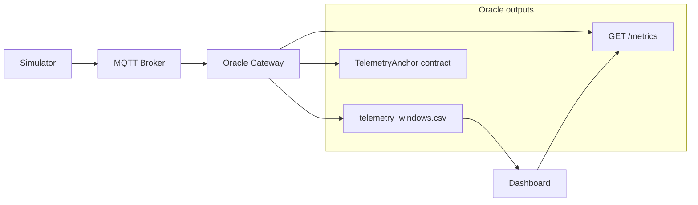
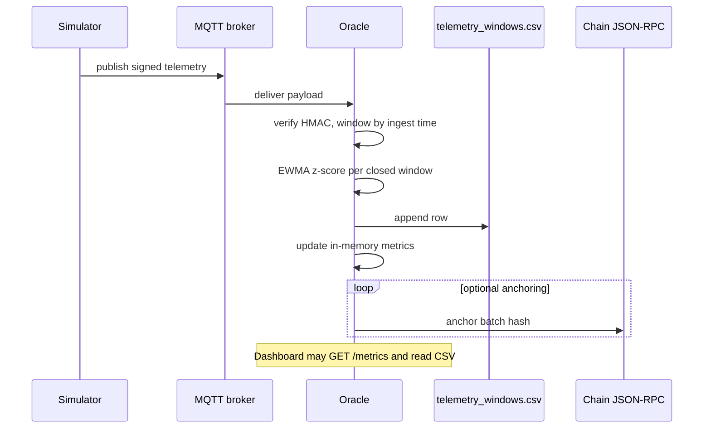
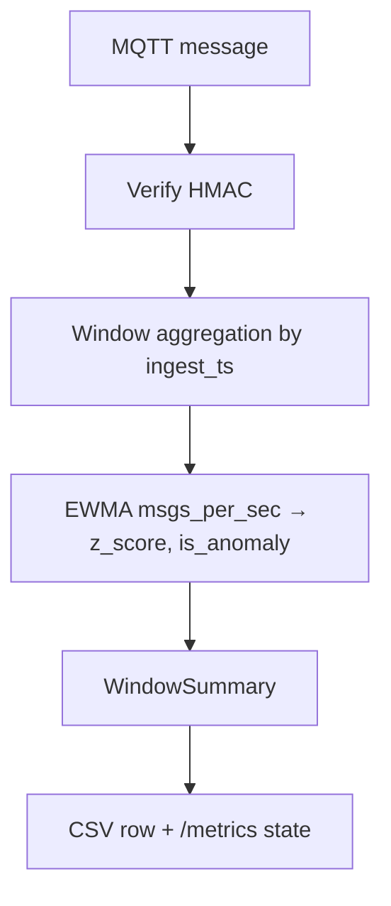

# Architecture

How data and control flow through the **IoT Oracle Gateway**: components, persistence, threading, and trust boundaries. For run instructions see the [README](../README.md).

## Scope

Single-machine demo/coursework stack: **no** horizontal scaling, **no** MQTT TLS in defaults, **no** production chain deployment. The design goal is a clear path from simulated devices → verified telemetry → windowed metrics → optional on-chain anchors.

## Components

| Piece | Role |
|-------|------|
| **Simulator** (`simulator/`) | Publishes signed JSON to MQTT topics `iot/devices/{id}/telemetry`. |
| **MQTT broker** | Fan-out; default Mosquitto `:1883`. |
| **Oracle** (`oracle/service.py`) | FastAPI app + background threads: consume MQTT, verify HMAC, aggregate windows, EWMA/z-score, append CSV, optional anchor loop, expose `GET /metrics`. |
| **TelemetryAnchor** (`contracts/`) | Solidity contract storing batch hashes; oracle sends txs when `CONTRACT_ADDRESS` is set. |
| **Dashboard** (`dashboard/app.py`) | Streamlit UI: polls `/metrics`, plots `telemetry_windows.csv` (or archived sessions), exports a zip, optional simulator start/stop. |

## System diagram

Anchoring and the dashboard are optional. The dashboard does not run the broker or oracle.

## End-to-end sequence

## Oracle internal pipeline

Each MQTT payload is **verified** (`oracle/verify.py`: JSON + HMAC). Invalid messages increment `rejected_count` and are dropped.

**Windowing** (`oracle/windows.py`): messages are bucketed by **ingest timestamp** into fixed **`WINDOW_SEC`** tumbling windows. Advancing time may finalize one or more windows; gaps produce empty windows (`msg_count=0`) so the timeline stays aligned.

**Anomaly detection** (`oracle/ewma.py`): for each finalized window, **`msgs_per_sec`** feeds an EWMA mean/variance; a **z-score** is computed vs the baseline. If the absolute z-score exceeds **`Z_THRESHOLD`**, **`is_anomaly`** is true for that window.

**Persistence**: each finalized window appends one CSV row (`oracle/service.py`). **`TELEMETRY_ROTATE_ON_START`** (when enabled) moves a non-empty active file into **`${DATA_DIR}/${TELEMETRY_ARCHIVE_SUBDIR}/`** before a new session file is created.

**Anchoring** (optional): a background thread runs on **`ANCHOR_INTERVAL_SEC`**. It batches pending `WindowSummary` records, builds a Merkle-like batch hash (`oracle/batch.py`), calls `send_anchor` (`oracle/anchor_contract.py`), and appends to **`anchoring_log.csv`**.

## Threading and processes

- **Main thread**: Uvicorn serves FastAPI (`GET /metrics`, lifespan hooks).
- **MQTT consumer thread**: reads a queue fed by the Paho client; enqueues `(payload, ingest_ts_ms)` for the consumer loop.
- **Consumer loop** (`_consumer_loop`): dequeues messages and calls `OracleState.handle_message` (serialized with a lock).
- **Anchor thread** (if anchoring configured): sleeps on an interval, runs `anchor_tick`.

The simulator and dashboard are **separate OS processes**; only the dashboard can optionally spawn the simulator subprocess on Windows.

## HTTP metrics

`GET /metrics` returns JSON: aggregate counters (`verified_count`, `rejected_count`), latest window fields (`msgs_per_sec`, `z_score`, `is_anomaly`, latency), and **`last_anchor_info`** (batch/tx hash, success, errors). The dashboard polls this on a timer; it does not push WebSockets.

## Dashboard data sources

| Source | Use |
|--------|-----|
| `GET /metrics` | Cards: traffic, anomaly, anchoring status. |
| `data/telemetry_windows.csv` (or `TELEMETRY_CSV_PATH`) | Time-series charts; **Telemetry session** selects active file or a file under **`telemetry_archive/`**. |
| `config/sim_config.json` | Read/write simulator parameters from the sidebar. |
| **Export results** | Zip: metrics JSON, sim config, selected telemetry CSV, logs, deployment JSON when present. |

## Persistence layout (typical)

| Path | Content |
|------|---------|
| `data/telemetry_windows.csv` | Active window rows (rotated if `TELEMETRY_ROTATE_ON_START` on oracle start). |
| `data/telemetry_archive/telemetry_windows_*.csv` | Archived sessions. |
| `data/anchoring_log.csv` | One row per anchoring attempt. |
| `data/anchor_log.txt` | Legacy text log (if used). |
| `contracts/deployments/localhost.json` | Deployed address (often gitignored). |

## Security and privacy (conceptual)

- **HMAC** ties payload fields to a shared secret; it is **integrity**, not confidentiality—payloads are plaintext on MQTT unless you add TLS yourself.
- **DEBUG** and **`SAFE_ERRORS`** control how much detail appears in logs, dashboard, and API responses.
- The oracle refuses the default **`HMAC_SECRET`** in non-debug mode unless **`ALLOW_INSECURE_DEFAULT_SECRET=true`**.

## Key modules (reference)

| Path | Responsibility |
|------|----------------|
| `oracle/service.py` | FastAPI app, `OracleState`, CSV append, metrics, rotation hook. |
| `oracle/mqtt_client.py` | Paho subscriber and queue handoff. |
| `oracle/windows.py` | `WindowAggregator`, `WindowSummary`. |
| `oracle/ewma.py` | `EWMAZScoreAnomalyDetector`. |
| `oracle/verify.py` | HMAC verification over canonical JSON. |
| `oracle/batch.py` | Batch hash for anchoring. |
| `oracle/anchor_contract.py` | Web3 contract call helpers. |
| `simulator/iot_simulator.py` | CLI/env config, publish loop. |
| `dashboard/app.py` | Streamlit pages and helpers. |
