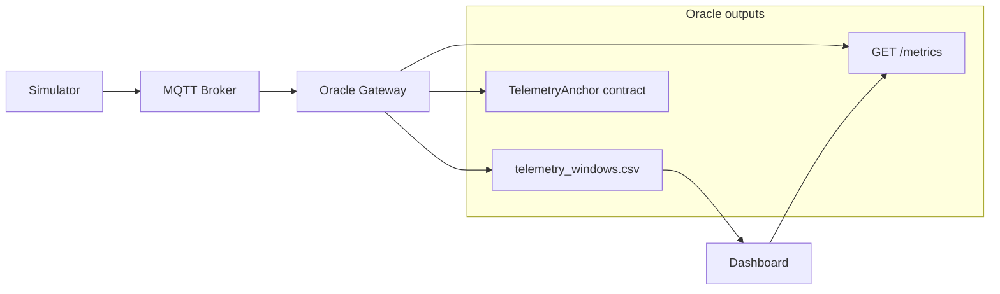
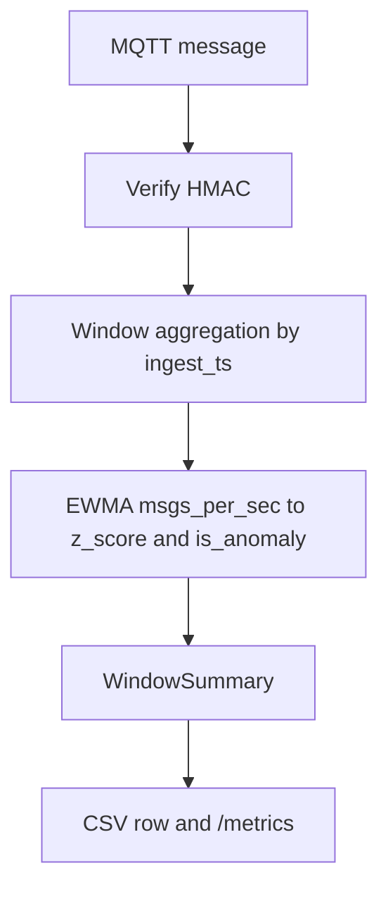

# Architecture (data flow)

This document describes how data moves through the IoT Oracle Gateway, with **text** below and **Mermaid** diagrams for the system view and the oracle-internal pipeline.

## System diagram

High-level components and data paths. Anchoring and the dashboard are optional.

## Window and EWMA pipeline

Inside the oracle: each MQTT payload is verified, assigned to a window by **ingest** time, then summarized; **EWMA** runs on **`msgs_per_sec`** per closed window to produce **z-score** and **is_anomaly** before persisting and exposing metrics.

## End-to-end flow

The **simulator** generates signed JSON telemetry and publishes it to an MQTT broker. The **oracle** subscribes to the telemetry topic, verifies each message with **HMAC**, and assigns it to a time window using **ingest time** (not payload time). When a window closes, the oracle computes **msgs_per_sec**, **latency**, runs **EWMA + z-score** anomaly detection, and appends a row to **`telemetry_windows.csv`**. Pending windows can be batched and anchored on-chain via the **`TelemetryAnchor`** contract (optional; requires `CONTRACT_ADDRESS` and RPC). The oracle exposes **`GET /metrics`** with live counters, the latest window, z-score, and last anchoring result. The **dashboard** (optional) polls **`/metrics`** and reads the telemetry CSV for charts; it can write **`config/sim_config.json`** for the simulator.

## Oracle internals (conceptual)

Inside the gateway, each MQTT-delivered payload is **verified** (reject if HMAC invalid). Verified messages feed a **window aggregator** that rolls up counts and rates per fixed **`WINDOW_SEC`**. Each finalized window updates an **EWMA** mean and variance of **`msgs_per_sec`**, producing a **z-score** and **`is_anomaly`** when the z-score exceeds **`Z_THRESHOLD`**. Summaries are **appended to CSV** and mirrored in **`/metrics`**. If anchoring is configured, a background loop periodically batches pending summaries, hashes them, and submits a transaction to the contract.
